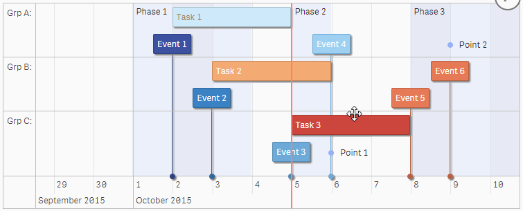
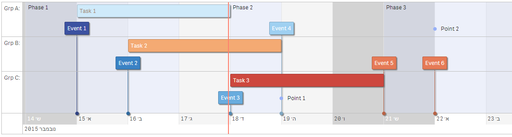
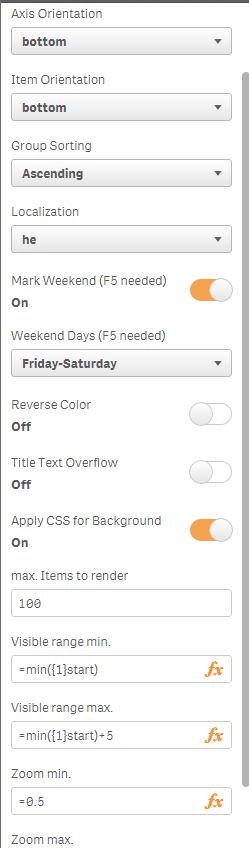

## Qlik Sense Extension Timeline

This extension implements vis.js timeline http://visjs.org/docs/timeline/. It is an interactive chart to visualize data items in time. The items can take place on a single date, or have a start and end date (a range).  You can freely move and zoom in/out the timeline by dragging and scrolling. 



Now with proper localization and adjustable weekend:



## Dimensions:

1. Dimension: Reference ID, numeric (Event ID or else) or String
2. Dimension: Item Content, text
3. Dimension: Start Date
4. Dimension: End Date (optional, null if omitted)
5. Dimension: Item Type (box (default), point, range, background)

## Measures:

1. Measure: title text for hover popup (optional), default title is start date, use ```<br>``` for line breaks
2. Measure: CSS class name for styling or number 1 to 10 for CSS class color-a to color-j which are configured for Qlik Sense diverging colors (blue-to-red, optional)
3. Measure: group name to group items in "swim lanes" (optional)

## Additional Properties:



1. Axis Orientation: top, bottom (default), both, none
2. Item orientation: top, bottom (default)
3. Stack Items     : stack items on top of each other such that they do not overlap (default: true)
4. Group Sorting   : Ascending, Descending
5. Localization    : choose local for localized date and timestamp formatting (default: en-gb)
6. Mark Weekend    : apply CSS class for background color of weekend (when zoomed-in), press F5 after change and save (default:true)
7. Weekend Days    : choose local weekend days (default: Saturday-Sunday), press F5 after change and save
8. Reverse Color   : reverse Qlik Sense diverging color (red-to-blue)
9. Apply CSS for Background : apply CSS class to background items (default: true)
10. max. Items to render: maximum items to render (default: 100), a large amount of items (if nothing is selected) needs much time, this limits the amount
11. max. Items to render: limit data records to display (default: 100)
12. Fit all events in window: zooms out to fit all events into visible window
13. Move focus to time: move focus to given time (eg. =now(1), default: 0, no focus)
14. Rolling Mode    : moves timeline so that current time is always centered (default: false) 
15. Visible range min.: limit visible date range mininum by numerical Qlik date or expression (default: 0, no min. date)
16. Visible range max.: limit visible date range maximum by numerical Qlik date or expression (default: 0, no max. date)
17. Zoom min.: minimum zoom resolution in days, 1/24 = 1 hr (default: 0, no minimum)
18. Zoom max.: maximum zoom resolution in days, 31 = 1 month (default: 0, no maximum)

## Author

**Ralf Becher**

+ [irregular.bi](http://irregular.bi)
* [twitter/irregularbi](http://twitter.com/irregularbi)
* [github.com/ralfbecher](http://github.com/ralfbecher)

## License

Copyright © 2015 Ralf Becher

Released under the MIT license.

***